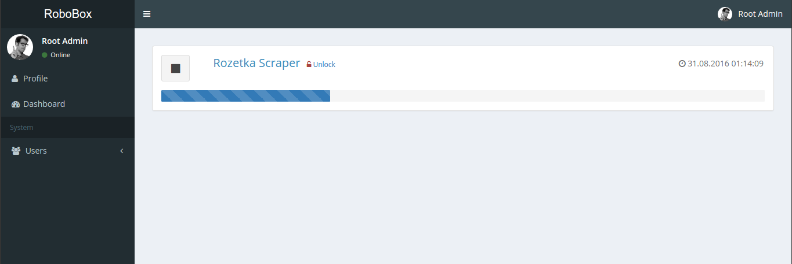
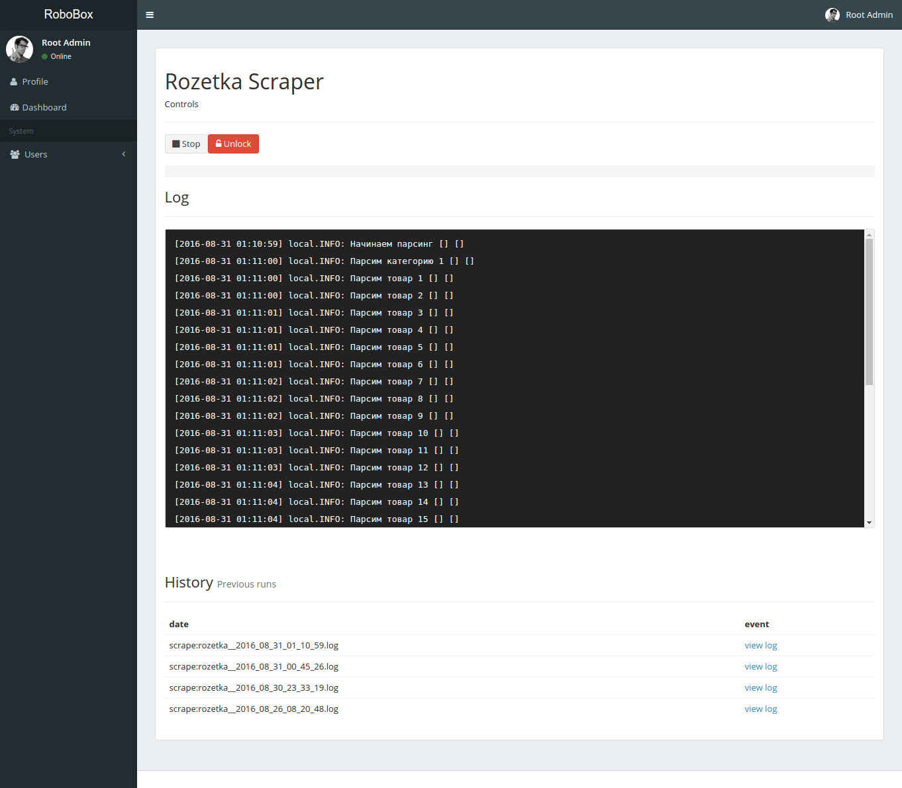
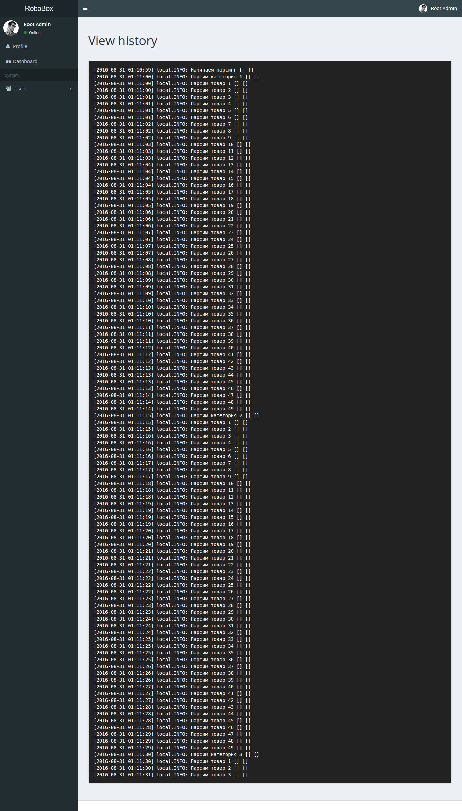

# Laravel Overseer Bootstrap

Front-end solution for [**Laravel Overseer**](https://github.com/exfriend/laravel-overseer)
 
## Requirements

 * VueJS
 * Laravel Overseer
 
## Installation

! This VueJS installation process is just for development stage.

Download `vue.js` and `vue-resource.js` into `/public/vuejs` folder.

``` 
composer require exfriend/overseer-bootstrap
```
 Then, add the package's service provider to your config/app.php:

 ```
 // ...
 Exfriend\Overseer\OverseerServiceProvider::class,
 Exfriend\OverseerBootstrap\OverseerBootstrapServiceProvider::class, 
```
## Web interface
 
### Task list
`GET http://your_project/tasks`

 
### Single Task
`GET http://your_project/tasks/task?command=App\Robots\Rozetka\Command`


### History
`GET http://your_project/tasks/log?command=App\Robots\Rozetka\Command&filename=scrape:rozetka__2016_08_31_01_14_09.log`



## Localization

Overseer-bootstrap has `en` and `ru` locales supported out of the box.

`php artisan vendor:publish --tag=overseer-bootstrap`

## Contributing

This package is work-in-progress. Pull requests are welcome. There is so much work ahead!

